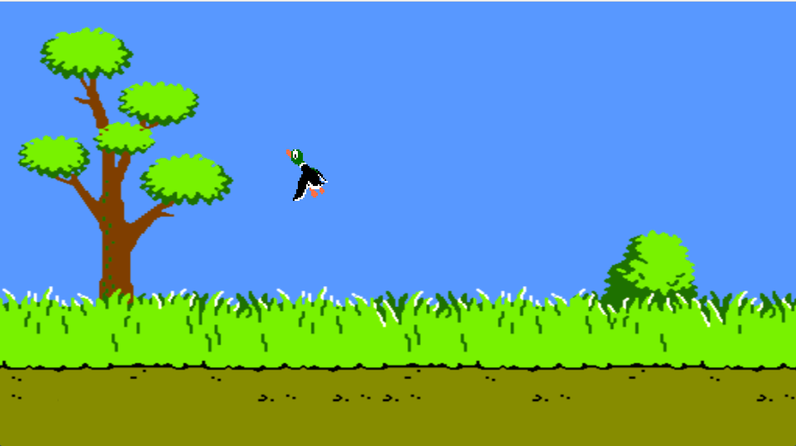

# Duck Hunt

For this exercise, you'll be building the classic Nintendo game, [Duck Hunt](https://en.wikipedia.org/wiki/Duck_Hunt).

You have been provided with starter code, so you will *only* need to work in the `duckhunt.js` file.

To make this activity more managable, it is broken into 3 parts. Additionally, you have been given guidance on each step.

Below are screenshots of what you will be creating. Feel free to get creative with how you style your interface!

